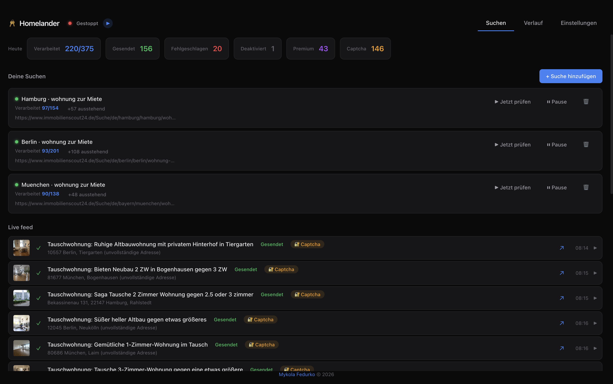
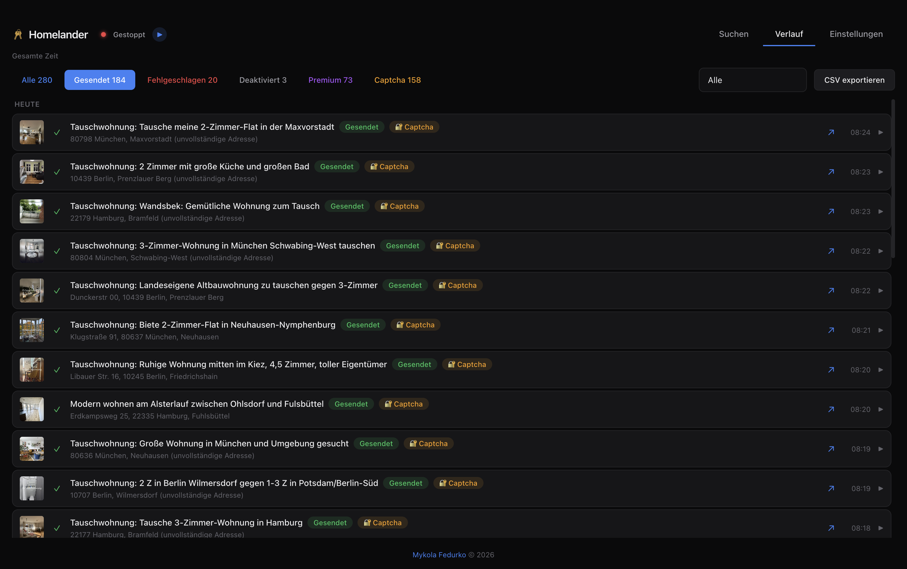
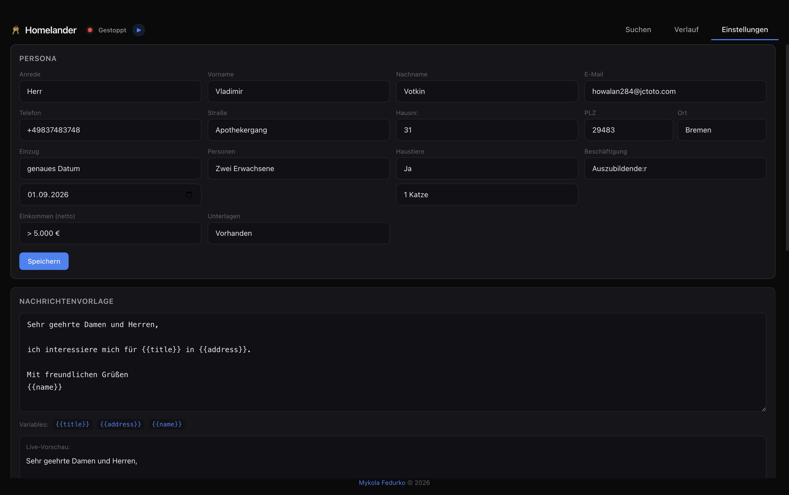

<p align="center">
  
</p>

<h1 align="center">Homelander — Kaufradar</h1>

<p align="center">
  <b>Analysis-only flat-purchase scanner</b><br>
  A fork of <a href="https://github.com/B1Z0N/homelander">B1Z0N/homelander</a> that watches IS24 and Kleinanzeigen
  buy listings, puts them on a map and mails a weekly report. It never applies to anything.
</p>

<p align="center">
  
  
  
</p>

## 🔭 About this fork

Upstream Homelander is a desktop app that auto-applies to IS24 rental listings. This fork keeps that intact and adds **Kaufradar**, a scan-only mode for *buying*: it collects IS24-buy and Kleinanzeigen listings, enriches and geocodes them, and serves a Leaflet map with photos, floor plans, a seen-flag, favourites, per-property file uploads, a U-/S-Bahn overlay and a weekly e-mail report. Scan filters are excluded from the apply loop by design, and the headless build ships without Electron or Chromium — it cannot send an application even by accident.

This fork publishes no desktop binaries; those come from the upstream [Releases](https://github.com/B1Z0N/homelander/releases). What you deploy from here is the Docker scanner below.

## 🗺️ Kaufradar — headless Docker scanner (analysis-only)

The scan half of Homelander (flat-purchase monitoring, Kaufradar browse site, JSON export, weekly e-mail report) runs headless — no Electron, no Chromium, and it can never send applications. Deploy it on a home server / Raspberry Pi like any other compose project:

```bash
cp .env.example .env           # searches + optional mail provider keys
docker compose up -d --build
# Kaufradar: http://<host-address>:8477 from any device on your LAN
```

Works on Raspberry Pi / ARM: the base image (`node:22-bookworm-slim`) is published for `arm64` and `arm/v7`, and the only native module (`better-sqlite3`) uses a prebuilt binary when available and otherwise compiles during the build — expect the first `docker compose up -d --build` on a Pi to take a few minutes.

Configure searches via `HOMELANDER_SCAN_URLS` in `.env` (comma-separated IS24 buy / Kleinanzeigen / Neubaukompass search URLs) or drop a `scan-searches.json` (array of URLs) into the `/data` volume. Data lives in the `homelander-data` volume: `homelander.db` and `scan-listings.json`.

The Kaufradar map overlays local U-/S-Bahn lines (route geometry fetched from Overpass into the data volume, refreshed monthly) and renders gold pins from an optional `/data/manual-projects.json` — a JSON array of `{ "name", "url", "address", "lat", "lng", "note" }` objects for Neubau projects that are marketed only on a developer's own site and never reach the portals.

Every entry — portal listing or Neubau pin — can be **starred** (★ button; "★ Nur Favoriten" filters the list and the map) and takes **file uploads**: drop the price lists, exposés and Grundriss PDFs a developer mails you onto the detail view and they stay with the property, in `/data/uploads/<hash>/`.

The weekly e-mail report sends via SMTP — set `HOMELANDER_REPORT_ENABLED=true`, `HOMELANDER_REPORT_TO`, and the `HOMELANDER_SMTP_*` variables in `.env`. For ProtonMail use `smtp.protonmail.ch:587` with a dedicated SMTP token (Unlimited plan or higher, paired with a custom-domain address; the From address must equal the token's address — it defaults to `HOMELANDER_SMTP_USER`). The desktop app configures the same thing under Settings → Wochenbericht.

⚠️ The Kaufradar has no authentication — the provided compose file exposes it to your LAN. Only do that on a private network you trust; on shared networks bind it to `127.0.0.1:8477:8477` and tunnel in.

## 📸 Screenshots

<p align="center">
  
  <br><sub>Search tab — manage searches, view live feed</sub>
</p>

<p align="center">
  
  <br><sub>History tab — browse sent applications, export CSV</sub>
</p>

<p align="center">
  
  <br><sub>Settings tab — persona, message template, captcha config</sub>
</p>

---

## 🚀 Why Homelander?

ImmobilienScout24 is Germany's largest real estate platform. Apartments in competitive markets (Berlin, Munich, Hamburg) get 100+ applications within hours. If you're not among the first to apply, you never hear back.

| Approach | Problem |
|----------|---------|
| **Manual refreshing** | You can't sit at your desk 24/7 hitting F5 |
| **Browser extensions** | Detectable, limited to what the browser can do |
| **Cloud bots** | Costs around a 100€ |
| **Homelander** | Runs on your computer, uses a real Chromium browser, handles captchas, auto-pauses on session expiry and AWS perimeter challenges |

Free. No terminal. No cloud. No manual refreshing. Set it and forget it.

## ✨ Features

- **🪄 One-click setup** — guided 6-step wizard, no terminal needed
- **🤖 Auto-apply** — fills IS24 contact forms via a bundled Chromium browser
- **🔐 Captcha solving** — optional, but automatic using 2captcha (~$0.001 per solve)
- **🧠 Smart pausing** — detects session expiry and AWS perimeter challenges, auto-pauses
- **⏱️ Three speed modes** — fast, balanced, slow (45-90s delays between applications)
- **💻 Cross-platform** — macOS, Windows, Linux
- **🌍 Multilanguage** — full German and English UI
- **📦 Local-first** — all data in SQLite, nothing sent to us

## ⬇️ Installation (desktop app)

Download the latest desktop build from the upstream **[Releases](https://github.com/B1Z0N/homelander/releases)** page — this fork ships the Docker scanner above, not binaries.

📺 Prefer video? **[Watch the demo](https://www.youtube.com/watch?v=udNWQz3WNBI)** (1:41) or the **[macOS install walkthrough](https://www.youtube.com/watch?v=tihX4nCKdwQ)** — download, Gatekeeper, and first launch.

| Platform | Package |
|----------|---------|
| macOS (Apple Silicon — M1 and newer) | `Homelander-<version>-arm64.dmg` |
| macOS (Intel) | `Homelander-<version>.dmg` — the one *without* `-arm64` |
| Windows | `Homelander.Setup.<version>.exe` |

Not sure which Mac you have? **Apple menu → About This Mac**: "Apple M…" means Apple Silicon, "Intel" means Intel.

### macOS — first run

macOS may block the app because it's not notarized. After moving to Applications, unblock it:

```bash
xattr -cr /Applications/Homelander.app
```

Then launch from Applications or Spotlight. ([See this step in the video](https://www.youtube.com/watch?v=tihX4nCKdwQ&t=53s))

### Windows

Download the `.exe` and run it. Windows SmartScreen may show a warning — click **More info** → **Run anyway**.

## ⚠️ Disclaimer

Homelander is a **fun portfolio / hobby project** created for educational purposes. It is **not intended to be used on ImmobilienScout24** and is in no way a tool for submitting actual applications or interacting with the IS24 platform. The Kaufradar additions in this fork are **analysis-only**: they read publicly reachable listing pages for personal use, submit nothing, and the headless build contains no apply engine at all.

This project is **not affiliated with, endorsed by, or connected to** ImmobilienScout24 GmbH, Kleinanzeigen GmbH & Co. KG, or any other listing portal. Automated access may violate a portal's terms of service — check them yourself before pointing this at anything. The authors assume no liability for any consequences, including but not limited to account restrictions, blocked access, legal claims, or any other actions taken by a portal operator or any other party. This software is provided "as is" without warranty of any kind.

## 🔧 First Launch

The setup wizard guides you through 6 steps:

1. **Language** - select german or english.
2. **Your details** — name, email, phone, address
3. **Message template** — the message sent with each application (use `{{title}}`, `{{address}}`, `{{name}}`)
4. **IS24 account** — log in manually (IS24 blocks automated login)
5. **2captcha API key** — for automatic captcha solving
6. **First search** — paste an IS24 search URL

After setup, the app opens to the Searches tab. Add more searches anytime.

## ⚙️ Configuration

All settings editable from the Settings tab:

| Setting | Description |
|---------|-------------|
| Persona | Your contact details (anrede, name, email, phone, address) |
| Message template | Use `{{title}}`, `{{address}}`, `{{name}}` placeholders |
| Timing | Speed preset (fast / balanced / slow), poll interval, send limits |
| Browser visibility | Hidden unless needed / always visible |
| 2captcha API key | Stored in your OS keychain |

Config lives at `~/.homelander/config.json`. Database at `~/.homelander/homelander.db` (SQLite, WAL mode).

## 📊 Data & Privacy

All data is **local** — nothing is sent anywhere except:

- **IS24's API** — to discover new listings
- **IS24's website via Chromium** — to submit contact forms (desktop apply mode only)
- **2captcha API** — to solve captchas (desktop apply mode only)
- **Portal listing pages** — scan mode fetches exposés to enrich Kaufradar entries
- **Overpass and Nominatim (OpenStreetMap)** — transit-line geometry and geocoding for the map, cached locally
- **Your configured mail provider** — only if the weekly report is enabled

No telemetry. No analytics. No cloud. Your `config.json`, `homelander.db`, and Chrome profile stay on your machine.

## 🛠️ Development

### Prerequisites

- **Node.js 20+** ([nodejs.org](https://nodejs.org))
- **Chrome** — bundled automatically via Puppeteer (no separate install)

### Install & Run

```bash
git clone https://github.com/jakubwaller/homelander.git
cd homelander
npm install
npm run dev
```

### Build

```bash
npm run dist:mac     # macOS .dmg + .zip
npm run dist:win     # Windows .exe (NSIS)
npm run dist:linux   # Linux .deb + .AppImage
```

## 📦 How it works

```
IS24 Mobile API ←─ HTTP ──→ [Poller → SQLite → Apply Engine → Chrome CDP] → IS24 Forms
                                   │                    │
                              Electron App            Headed
                              (React UI)    
```

1. **You paste an IS24 search URL** — any valid search, including Tauschwohnung
2. **Poller hits IS24's mobile API** every 10 minutes for new listings
3. **New listings land in SQLite** — deduplicated, timestamped
4. **Apply engine opens each listing** in a background Chromium window, fills the contact form with your details, and submits
5. **Captchas are solved** via 2captcha automatically
6. **Results appear** in the live feed and history — SENT, FAIL, etc.

Everything runs on your computer. Your data stays local.

## ❓ FAQ

**Is this safe?** Yes. Everything runs locally. Your IS24 credentials and personal data never leave your computer except when submitting to IS24 (via the same browser IS24 expects).

**Can IS24 detect me?** Homelander uses a real Chromium browser, natural typing delays, and behaves like a human. The bundled Chromium profile matches what IS24 sees from regular users.

**What does it cost?** The app is free and open-source. You only pay 2captcha for solving captchas, and that is optional (~$0.001/solve, about $3 for hundreds of applications).

**Does it work outside Germany?** The app works anywhere, but it's designed for the German ImmobilienScout24 platform.

**Can I search multiple areas?** Yes. Add multiple search URLs — each polls independently.

## 🤝 Contributing

Issues and discussions are disabled on this fork. For the desktop app, report bugs and feature ideas [upstream](https://github.com/B1Z0N/homelander/issues). See [CONTRIBUTING.md](CONTRIBUTING.md) for dev setup.

## ❤️ Support

If the Kaufradar helped you, you can buy me a coffee: <https://ko-fi.com/jakubwaller>

The desktop app and its auto-apply engine are [B1Z0N](https://github.com/B1Z0N)'s work — support him on [GitHub Sponsors](https://github.com/sponsors/B1Z0N), [Buy Me a Coffee](https://www.buymeacoffee.com/b1z0n) or [Ko-fi](https://ko-fi.com/b1z0n).

## 📄 License

MIT. Original project © [Mykola Fedurko](https://github.com/B1Z0N), Kaufradar fork additions © [Jakub Waller](https://github.com/jakubwaller). See [LICENSE](LICENSE).

## 🙏 Credits

Built on an auto-apply engine developed and battle-tested across thousands of IS24 listings. Key icon brand by the original author.
