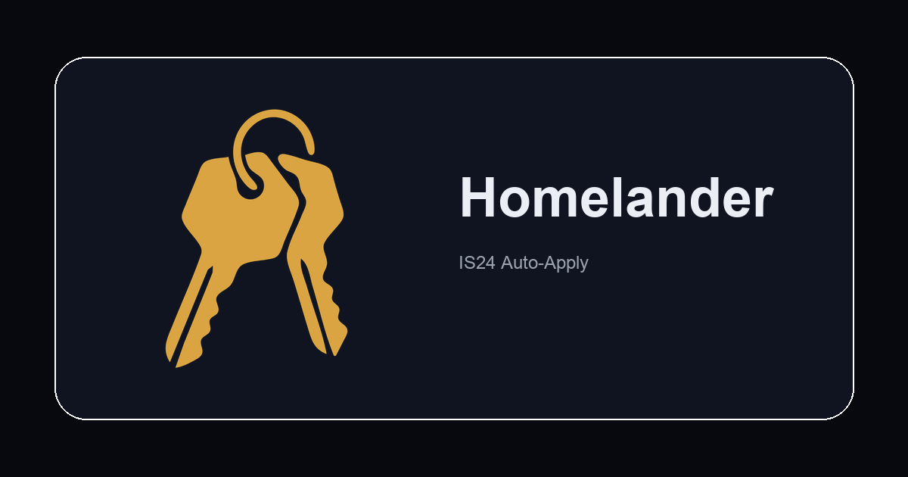

<p align="center">
  
</p>

<h1 align="center">Homelander</h1>

<p align="center">
  <b>Desktop app that automates apartment applications on ImmobilienScout24</b><br>
  Paste a search URL — it polls for new listings and auto-applies for you.
</p>

<p align="center">
  <a href="https://github.com/B1Z0N/homelander/actions/workflows/ci.yml"></a>
  
  
  
</p>

<p align="center">
  
</p>

---

## 🚀 Why Homelander?

ImmobilienScout24 is Germany's largest real estate platform. Apartments in competitive markets (Berlin, Munich, Hamburg) get 100+ applications within hours. If you're not among the first to apply, you never hear back.

| Approach | Problem |
|----------|---------|
| **Manual refreshing** | You can't sit at your desk 24/7 hitting F5 |
| **Browser extensions** | Detectable, limited to what the browser can do |
| **Cloud bots** | Costs around a 100€ |
| **Homelander** | Runs on your computer, uses a real Chromium browser, handles captchas, auto-pauses when IS24 rate-limits you |

Free. No terminal. No cloud. No manual refreshing. Set it and forget it.

## ✨ Features

- **🪄 One-click setup** — guided 6-step wizard, no terminal needed
- **🤖 Auto-apply** — fills IS24 contact forms via a bundled Chromium browser
- **🔐 Captcha solving** — optional, but automatic using 2captcha (~$0.001 per solve)
- **🧠 Smart pausing** — detects captcha walls, session expiry, and AWS perimeter challenges, auto-pauses
- **⏱️ Three speed modes** — fast, balanced, slow (45-90s delays between applications)
- **💻 Cross-platform** — macOS, Windows, Linux
- **🌍 Multilanguage** — full German and English UI
- **📦 Local-first** — all data in SQLite, nothing sent to us

## 📦 How it works

```
IS24 Mobile API ←─ HTTP ──→ [Poller → SQLite → Apply Engine → Chrome CDP] → IS24 Forms
                                   │                    │
                              Electron App         Headed, offscreen
                              (React UI)           (-32000,-32000px)
```

1. **You paste an IS24 search URL** — any valid search, including Tauschwohnung
2. **Poller hits IS24's mobile API** every 10 minutes for new listings
3. **New listings land in SQLite** — deduplicated, timestamped
4. **Apply engine opens each listing** in a background Chromium window, fills the contact form with your details, and submits
5. **Captchas are solved** via 2captcha automatically
6. **Results appear** in the live feed and history — SENT, FAIL, captcha_wall, session_expired, etc.

Everything runs on your computer. Your data stays local.

## 🏃 Contributing Quick Start

### Prerequisites

- **Node.js 20+** ([nodejs.org](https://nodejs.org))
- **Chrome** — bundled automatically via Puppeteer (no separate install)
- **2captcha account** ([2captcha.com](https://2captcha.com)) — ~$3 covers hundreds of applications

### Install & Run

```bash
git clone https://github.com/B1Z0N/homelander.git
cd homelander
npm install
npm run dev
```

### Build

```bash
npm run dist:mac     # macOS .dmg + .zip
npm run dist:win     # Windows .exe (NSIS)
npm run dist:linux   # Linux .deb + .AppImage
```

## 🔧 First Launch

The setup wizard guides you through 6 steps:

1. **Language** - select german or english.
2. **Your details** — name, email, phone, address
3. **Message template** — the message sent with each application (use `{{title}}`, `{{address}}`, `{{name}}`)
4. **IS24 account** — log in manually (IS24 blocks automated login)
5. **2captcha API key** — for automatic captcha solving
6. **First search** — paste an IS24 search URL

After setup, the app opens to the Searches tab. Add more searches anytime.

## ⬇️ User Downloads

Pre-built binaries on the [Releases](https://github.com/B1Z0N/homelander/releases) page:

| Platform | Package |
|----------|---------|
| macOS (Apple Silicon) | `Homelander-*.arm64.dmg` |
| macOS (Intel) | `Homelander-*.dmg` |
| Windows | `Homelander-*.exe` |

## ⚙️ Configuration

All settings editable from the Settings tab:

| Setting | Description |
|---------|-------------|
| Persona | Your contact details (anrede, name, email, phone, address) |
| Message template | Use `{{title}}`, `{{address}}`, `{{name}}` placeholders |
| Timing | Speed preset (fast / balanced / slow), poll interval, send limits |
| Browser visibility | Hidden unless needed / always visible |
| 2captcha API key | Stored in your OS keychain |

Config lives at `~/.homelander/config.json`. Database at `~/.homelander/homelander.db` (SQLite, WAL mode).

## 📊 Data & Privacy

All data is **local** — nothing is sent anywhere except:

- **IS24's API** — to discover new listings
- **IS24's website via Chromium** — to submit contact forms
- **2captcha API** — to solve captchas

No telemetry. No analytics. No cloud. Your `config.json`, `homelander.db`, and Chrome profile stay on your machine.

## ❓ FAQ

**Is this safe?** Yes. Everything runs locally. Your IS24 credentials and personal data never leave your computer except when submitting to IS24 (via the same browser IS24 expects).

**Can IS24 detect me?** Homelander uses a real Chromium browser, natural typing delays, and behaves like a human. The bundled Chromium profile matches what IS24 sees from regular users.

**What does it cost?** The app is free and open-source. You only pay 2captcha for solving captchas, and that is optional (~$0.001/solve, about $3 for hundreds of applications).

**Does it work outside Germany?** The app works anywhere, but it's designed for the German ImmobilienScout24 platform.

**Can I search multiple areas?** Yes. Add multiple search URLs — each polls independently.

## 🤝 Contributing

Contributions are welcome! See [CONTRIBUTING.md](CONTRIBUTING.md) for setup and guidelines.

- Bug reports → [Issue template](https://github.com/B1Z0N/homelander/issues/new?template=bug_report.yml)
- Feature ideas → [Feature request](https://github.com/B1Z0N/homelander/issues/new?template=feature_request.yml)
- Questions → [Discussions](https://github.com/B1Z0N/homelander/discussions)

## 📄 License

MIT © [Mykola Fedurko](https://github.com/B1Z0N)

## 🙏 Credits

Built on an auto-apply engine developed and battle-tested across thousands of IS24 listings. Key icon brand by the author.
